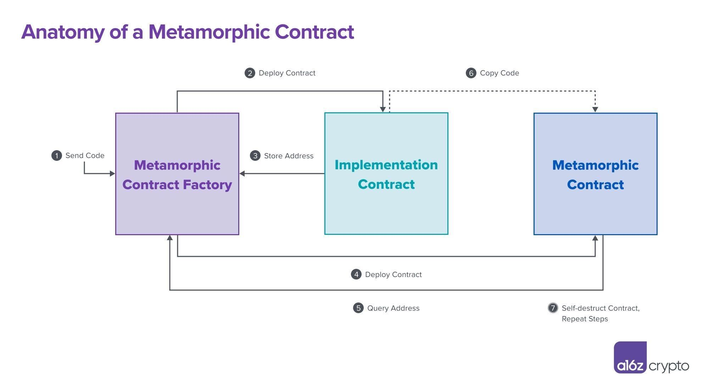

# Metamorphic Contract Detector



## Overview

A critical Ethereum security assumption is that smart contract code is immutable and therefore cannot be changed once it is deployed on the blockchain. In practice, some smart contracts can change – even after they’ve been deployed. With a few clever tricks, you can create metamorphic smart contracts that “[metamorphose](https://medium.com/@0age/the-promise-and-the-peril-of-metamorphic-contracts-9eb8b8413c5e)” into something else – and by understanding what makes them possible, you can detect them.

Metamorphic smart contracts are mutable, meaning developers can change the code inside them. These smart contracts pose a serious risk to web3 users who put their trust in code that they expect to run with absolute consistency, especially as bad actors can exploit this shape-shifting ability. Imagine an attacker using the technique to “rug” people who are staking tokens in a smart contract they don’t realize is metamorphic. Attacks based on this and similar premises could equip scammers to prey on people and generally undermine trust in the full promise of decentralized systems.

To analyze if a smart contract contains metamorphic properties, I built a simple Metamorphic Contract Detector (inspired by and building on the original work of [Jason Carver](https://medium.com/@jason.carver/defend-against-wild-magic-in-the-next-ethereum-upgrade-b008247839d2), [0age](https://medium.com/@0age/the-promise-and-the-peril-of-metamorphic-contracts-9eb8b8413c5e), and [others](https://ethereum-magicians.org/t/potential-security-implications-of-create2-eip-1014/2614)). Anyone can use the tool to check whether a given contract exhibits red flags that could indicate the potential for metamorphism. The method is not fool-proof: just because a smart contract shows a flag, doesn’t mean it’s necessarily metamorphic; and just because it doesn’t, doesn’t mean it’s safe. The checker merely offers a quick initial assessment that a contract might be metamorphic based on possible indicators. 

You can read my full post on Metamorphic Smart Contracts [here](https://a16zcrypto.com/metamorphic-smart-contract-detector-tool)

This repository contains a command-line tool and streamlit app to detect metamorphic smart contracts on the Ethereum blockchain. Specifically, the command-line tool and streamlit app detect six things:

1. `contains_metamorphic_init_code`: The detector will check if [known metamorphic bytecode](https://github.com/0age/metamorphic/blob/master/contracts/MetamorphicContractFactory.sol) shows up in a transaction for a given smart contract’s deployment, that’s a major red flag. An important caveat: There are potentially innumerable variations of metamorphic bytecode, which makes detecting all varieties difficult. By scanning for well-known instances though, the detector eliminates low-hanging fruit for attackers who are merely copying and pasting existing examples.

2. `contains_selfdestruct`: To replace the code in a contract – a key step in creating a metamorphic contract – a developer first needs to delete pre-existing code. The only way to do this is by using the [SELFDESTRUCT opcode](https://docs.soliditylang.org/en/v0.8.13/introduction-to-smart-contracts.html?highlight=selfdestruct#deactivate-and-self-destruct) (`0xFF`), a command that does exactly what it sounds like – it erases all code and storage at a given contract address. The presence of self-destructing code in a contract does not prove that it is metamorphic; however, it offers a clue that the contract might be metamorphic and it’s worth knowing, anyway, whether contracts you’re relying on can nuke themselves.

3. `contains_delegatecall`: The detector will check if the smart contract in question can't directly self-destruct, it may still be able to erase itself by using the [DELEGATECALL opcode](https://docs.soliditylang.org/en/v0.8.13/introduction-to-smart-contracts.html?highlight=delegatecall#delegatecall-callcode-and-libraries). This opcode allows a smart contract dynamically to load and execute code that lives inside another smart contract. Even if the smart contract doesn't contain the SELFDESTRUCT opcode, it can use DELEGATECALL to load self-destructing code from somewhere else. While the DELEGATECALL functionality does not directly indicate if a smart contract is metamorphic, it is a possible clue – and potential security issue – that’s worth noting. Be warned that this indicator has the potential to raise many false positives. 

4. `deployed_by_contract`: Metamorphic contracts can be deployed only by other smart contracts. This is because metamorphic contracts are enabled by another opcode, usable only by other smart contracts, called CREATE2. This trait is one of the least conspicuous indicators of possible metamorphism; it is a necessary but insufficient precondition. Scanning for this trait is likely to raise many false positives – but it is valuable information to know as it can raise suspicions and provide a reason to scrutinize a contract further, especially if the smart contract contains the opcode described next.

5. `deployer_contains_create2`: If a deployer contract contains the CREATE2 opcode, that may indicate that it used CREATE2 to deploy the contract in question. If the deployer did indeed use CREATE2 to deploy said contract, while that doesn’t mean the contract is necessarily metamorphic, it does mean that it might be metamorphic and it may be wise to proceed with caution and investigate further.

6. `code_has_changed`: This is the most obvious tell, but it will only show up after a metamorphic contract has already morphed. If the smart contract’s code hash – a unique, cryptographic identifier – is different than it was when the contract was initially deployed, then it’s likely the code was removed, replaced, or altered. If the hashes no longer match, then something about the code has changed and the contract might be metamorphic. This flag is the surest indicator of metamorphism, but it won’t help predict or preempt morphing since it only checks that it already happened.

Additionally, this repository contains a series of `/contracts` and `/test` that demonstrate how a metamorphic smart contract works in practice. Specifically, these smart contracts demonstrate:

1. Deploying a metamorphic smart contract where users can stake an ERC-20 token to earn a yield.
2. Replacing the code of that smart contract to include a malicious function that allows someone to steal all staked tokens.

## Installation

### **Command-Line Tool and Streamlit App Installation**

First, obtain an Alchemy API key. You can sign up for a free account at [alchemy.com](https://www.alchemy.com/). This command-line tool and streamlit app requires that your Alchemy API key has [tracing enabled](https://docs.alchemy.com/alchemy/enhanced-apis/trace-api).

Second, install [poetry](https://python-poetry.org/docs/).

Third, clone this repo and install dependencies with the following commands:

```
git clone https://github.com/a16z/metamorphic-contract-detector.git
cd metamorphic-contract-detector
poetry install
```

### **Smart Contracts and Hardhat Tests Installation**

Install hardhat and other npm packages with

```
npm i
```

## Usage

### **Command-Line Tool**

Here is an example command to check if `0x00000000008c9782FF4EB38e9293eE3DFA75FA9e` is metamorphic:

```
poetry run python cli.py 0x00000000008c9782FF4EB38e9293eE3DFA75FA9e <INSERT ALCHEMY API KEY HERE>
```

The output should look something like this:
```
Code Changed: FALSE
Contains Metamorphic Init Code: TRUE
Contains SELFDESTRUCT: TRUE
Contains DELEGATECALL: TRUE
Deployed by Contract: TRUE
Deployer Contains CREATE2: TRUE
```

### **Streamlit App**

First, add your Alchemy api key into a `.env` file in the repo directory. It should look something like this:

```
ALCHEMY_API_KEY="INSERT API KEY HERE"
```

Next, run the following command to launch the streamlit app in your browser:

```
poetry run streamlit run streamlit_app.py
```

I also deployed a sample of this streamlit app [here](https://metamorphic.a16zcrypto.com/).

### **Smart Contracts and Hardhat Tests**

To execute the hardhat tests that simulate staking tokens in a metamorphic contract, replacing the code in that contract, and stealing the staked tokens, run the following command:

```
npx hardhat test
```

## More Examples

Here are a few metamorphic contracts on Ethereum you can analyze with the command-line tool and streamlit app:

- [0x00000000008c9782FF4EB38e9293eE3DFA75FA9e](https://etherscan.io/address/0x00000000008c9782ff4eb38e9293ee3dfa75fa9e)
- [0x00000000b7ca7E12DCC72290d1FE47b2EF14c607](https://etherscan.io/address/0x00000000b7ca7E12DCC72290d1FE47b2EF14c607)
- [0x000000009B988FbecFd83C55252f78592E609648](https://etherscan.io/address/0x000000009B988FbecFd83C55252f78592E609648)
- [0x1d6E8BAC6EA3730825bde4B005ed7B2B39A2932d](https://etherscan.io/address/0x1d6E8BAC6EA3730825bde4B005ed7B2B39A2932d)

## Related Work and Credits

- https://github.com/MrLuit/selfdestruct-detect/blob/master/src/index.ts
- https://ethereum-magicians.org/t/potential-security-implications-of-create2-eip-1014/2614
- https://github.com/0age/metamorphic
- https://github.com/0age/metamorphic/blob/master/contracts/MetamorphicContractFactory.sol
- https://medium.com/@jason.carver/defend-against-wild-magic-in-the-next-ethereum-upgrade-b008247839d2

## Metamorphic Init Code Breakdown

Here is an opcode by opcode walkthrough of Metamorphic Init Code. This combines my own descriptions with [0age's](https://github.com/0age/metamorphic/blob/master/contracts/MetamorphicContractFactory.sol).

You can load these opcodes and comments directly into [evm.codes](https://www.evm.codes/playground) and step through each opcode one at a time using this [link](<https://www.evm.codes/playground?unit=Wei&codeType=Mnemonic&code='%2F%2F%20ThQB%20opcodQexecuteJcodQthaFliveJaFa%20specified%20%3BJonqblockchain%5Egas%3A%20%C2%82inqcall%20toqspecified%20%3BJ%20~2.%20%3Bs%3AqETH%20%3BJyou%20arQcalling%20to~3.%20argsOffset%3A%20ThQstarting%20%C2%86ofqcalling%20smarF(FthaFcontainsqcall%40to%20send%20along%20i*your%20B~4.%20argSize%3A%20%C2%81qcall%40you%20arQsending%20i*B~5.%20retOffset%3A%20%C2%86wherQyou%20wanFto%20storQany%20%40%7Fby%20B~6.%20retSize%3A%20%C2%81q%7Fdata)~M%2BIniFCode%3A%200x5860208158601c335a63aaf10f428752fa158151803b80938091923cf3)~ThQfirsFsectio*of%20thiJiniFcodQpusheJ%40ontoq~stack%20thaFiJneeded%20for%60B%20toqm%2Bfactory%20(F)~%3C%20SECTION%201%20%3C)~push%600!%20)PCV0%3Eqnumber%2032!%20%7B0x20%20%3D%3D%2032%C2%88sizQof%20%40i*byteJthaF%7CbQ%7Fby%20B~%5C'retSize%23PUSH1%200x20V0j32%3E%600!.~ThiJisqindex%20i*(F%26wherQany%20%7F%40from%20B%20%7CbQstored~%5C'retOffset%23DUP2%20V0j32j0%3E%604!~thiJisq%C2%81qcall%40senFalong%20i*B~NOTE%3A%204%20byteJisqlength%20of%60%24.%20WQ%7CbQcalling%60functio*i*thiJB~%5C'argSize%23PCV0j32j0j4%3E%2028!%20%7B0x1c%20%3D%3D%2028%C2%88positio*ofq%24%20i*(Fmemory~thQreaso*for%2028%20iJbecausQyou%20storQ32%20byteJaFa%20timQi*memory~soqindex%20after%20storing%604%20bytQ%24%20%7CbQ28%20%7B32-4%7D.~seQhowq%40iJpadded%20by%20zeroJi*evm.codes~%5C'argsOffset%23PUSH1%200x1c%20V0j32j0j4j28%3Eqcaller%20%3BJonqstack~thiJwould%20beqfactory%20addesJthaFiJdeployingqm%2B(t~%5C'%3Bs%23CALLER%22%3Eq%C2%82along%20with%20B~%5C'gas%23GAS%22jgas%5D))~pushq%24!~thiJisqfirsF4%20byteJofqKeccak-256%20hash%20ofqfunctio*getI%3Fn%7B%7D%20inqfactory%20(t.~thiJisq%40you%20%7CstorQi*%26using%20MSTORE.)PUSH4%200xaaf10f42%20%22jgasj0xaaf10f42%3E%600!~thiJisqindex%20of%20wherQto%20storeq%24%20i*%26forqnexFMSTORE%20opcode)DUP8%22jgasj0xaaf10f42j0%5D)~storeq%24%20i*memory~againq%C2%86for%20wherQiF%7CbQiJ28%20%7BseQevm.codes%7D)MSTORE%22jgas%5D)~performqB%20using%20several%20valueJyou%20havQpushed!%20up%20until%20thiJpoint~thiJB%20%7Cfetchq(F%3BJthaFcontains~thQi%3F*codQyou%20%7Clater%20storQinqm%2B(t.%20)BV0j1%20%7Bif%20successful%7D%5D)))~%3C%20SECTION%202%20%3C~now%20thaFyou%20haveqi%3F*%3BJi*memory~copyq%C2%83FthaF%3BJintoqcurrenF(F%7BthQm%2B(t%7D~two%20mai*opcodeJi*thiJsectio*arQ%C2%84%20and%20%25)~ThQ%C2%84%20opcodQtakeJaJinpuFa%20(F%3BJand%20returnsqbytQsizQofqcodQaFthaF%3Bs~ThiJ%40iJneeded%20for%20%25)~ThQ%25%20opcodQcopiesqruntimQ%C2%83Fa%20specific%20%3BJand%20storeJiFi*memory%5E%3Bs%3A%2020-bytQ%3BJofq(FwhosQcodQyou%20wanFto%20copy%20into%20%26~2.%20destO%C2%87*%26whereqresulF%7CbQcopied.%20ThiJisq%26ofqm%2B(t.~3.%20o%C2%87nq%C2%85ofq%3BJwQarQcopying%20codQfrom~%20%20%20ThQ%C2%85isqarea%20of%20general%20Ethereum%20accounFstoragQwhereqruntimQcodQof%60smarF(FiJlocated.~%20%20%20Lear*morQhere%3A%20https%3A%2F%2Fwww.evm.codes%2Fabout~4.%20size%3A%20bytQsizQofqcodQto%20copy%20%7Byou%20geFthiJfrom%20%C2%84%7D))~flip%20succesJbiF%7Bo*top%20ofqstack%7D%20to%200)ISZEROV0j0%3E%20another%200!~thiJisqpositio*ofq%3BJfetched%20from%20B%20i*memory)DUP2V0j0j0%5D)~load%2032%20byteJof%20%40from%20index%200%20i*memory~thiJwould%20containq(F%3BJ%7FbyqB)MLOADV0j0j_%3Eq_!%20agai*for%20%25%20to%20consume)DUP1V0j0j_j_%5D)~retur*%C2%81%20%C2%83tq_~and%20push%20thiJvaluQontoqstack)%C2%84V0j0j_j(Fsize%5D)~manipulatQ%C2%89usQbyqRETURN%20opcodQatqend%20of%20thiJiniFcode)DUP1)SWAP4V(Fsizej0j_j(Fsizej0%5D%20%20%20)~push%200!~ThiJ0%20representsq%5C'o%C2%80%20and%20iFiJreferencingq%5C'code%5C'~regio*ofq_.~nextjreorder%20%C2%89%25)DUP1)SWAP2)SWAP3V(Fsizej0j(Fsizej0j0j_%5D%20)~executeq%25%20opcodQwhich%20clonesqruntimQcodQofqi%3F*(t~into%20%26aFpositio*0%20orq%5C'destO%C2%80)%25V(Fsizej0%5D%20)~RETURN%20to%20deployqfinal%20codQthaFiJcurrently%20i*%26~and%20effectively%20storeqi%3F*(FcodQatqm%2B(F%3Bs)RETURN'~)%2F%2F%20q%20thQj%2C%20_i%3F*(F%3BsV~STACK%3A%20%5BQe%20Js%20Ft%20BSTATICCALL*n%20)%5Cn(contrac!%20ontoqstack%22V0j32j0j4j28jfactory%20%3Bs%23%5C'%20inpuFto%20B)%24functio*selector%25EXTCODECOPY%26memory%20%2Betamorphic%20%3Baddres%3C%3D%3D%3D%3D%3D%3D%3D%3E%5D)~push%3Fmplementatio%40data%20%5E.~IFtakeJa%20few%20parameterJaJinput~1.%20%60%20a%20%7Cwill%20%7Freturned%20%C2%80ffset%5C'%20parameter%20of%20%25%C2%81sizQi*byteJof%C2%82amounFof%20gaJto%20send%20%C2%83codQstored%20a%C2%84EXTCODESIZE%C2%85%5C'code%5C'%20regio*%C2%86index%20i*%26%C2%87ffset%3AqbytQoffseFi%C2%88%20i*hex%7D.~thiJisq%C2%89stack%20itemJfor%20%01%C2%89%C2%88%C2%87%C2%86%C2%85%C2%84%C2%83%C2%82%C2%81%C2%80%7F%7C%60%5E%40%3F%3E%3C%3B%2B%26%25%24%23%22!()*BFJQV_jq~_>)

```c
// The STATICCALL opcode executes code that lives at a specified address on the blockchain.
// It takes a few parameters as input
// 1. gas: amount of gas to send in the call to the specified address
// 2. address: the ETH address you are calling to
// 3. argsOffset: The starting index in memory of the calling smart contract that contains the calldata to send along in your STATICCALL
// 4. argSize: size in bytes of the calldata you are sending in STATICCALL
// 5. retOffset: index in memory where you want to store any data returned by STATICCALL
// 6. retSize: size in bytes of the returned data

// Metamorphic Init Code: 0x5860208158601c335a63aaf10f428752fa158151803b80938091923cf3

// The first section of this init code pushes data onto the
// stack that is needed for a STATICCALL to the metamorphic factory contract

// ======= SECTION 1 =======

// push a 0 onto the stack
PC
// STACK: [0]

// push the number 32 onto the stack (0x20 == 32 in hex).
// this is the size of data in bytes that will be returned by STATICCALL
// "retSize" input to STATICCALL
PUSH1 0x20
// STACK: [0, 32]

// push a 0 onto the stack.
// This is the index in contract memory where any returned data from STATICCALL will be stored
// "retOffset" input to STATICCALL
DUP2
// STACK: [0, 32, 0]

// push a 4 onto the stack
// this is the size in bytes of the calldata sent along in STATICCALL
// NOTE: 4 bytes is the length of a function selector. We will be calling a function in this STATICCALL
// "argSize" input to STATICCALL
PC
// STACK: [0, 32, 0, 4]

// push 28 onto the stack (0x1c == 28 in hex).
// this is the position of the function selector in contract memory
// the reason for 28 is because you store 32 bytes at a time in memory
// so the index after storing a 4 byte function selector will be 28 (32-4).
// see how the data is padded by zeros in evm.codes
// "argsOffset" input to STATICCALL
PUSH1 0x1c
// STACK: [0, 32, 0, 4, 28]

// push the caller address on the stack
// this would be the factory addess that is deploying the metamorphic contract
// "address" input to STATICCALL
CALLER
// STACK: [0, 32, 0, 4, 28, factory address]

// push the amount of gas to send along with STATICCALL
// "gas" input to STATICCALL
GAS
// STACK: [0, 32, 0, 4, 28, factory address, gas]


// push the function selector onto the stack
// this is the first 4 bytes of the Keccak-256 hash of the function getImplementation() in the factory contract.
// this is the data you will store in memory using MSTORE.
PUSH4 0xaaf10f42
// STACK: [0, 32, 0, 4, 28, factory address, gas, 0xaaf10f42]

// push a 0 onto the stack
// this is the index of where to store the function selector in memory for the next MSTORE opcode
DUP8
// STACK: [0, 32, 0, 4, 28, factory address, gas, 0xaaf10f42, 0]

// store the function selector in memory
// again the index in memory for where it will be is 28 (see evm.codes)
MSTORE
// STACK: [0, 32, 0, 4, 28, factory address, gas]

// perform the STATICCALL using several values you have pushed onto the stack up until this point
// this STATICCALL will fetch the contract address that contains
// the implementation code you will later store in the metamorphic contract.
STATICCALL
// STACK: [0, 1 (if successful)]


// ======= SECTION 2 =======
// now that you have the implementation address in memory
// copy the code stored at that address into the current contract (the metamorphic contract)
// two main opcodes in this section are EXTCODESIZE and EXTCODECOPY

// The EXTCODESIZE opcode takes as input a contract address and returns the byte size of the code at that address
// This data is needed for EXTCODECOPY

// The EXTCODECOPY opcode copies the runtime code stored at a specific address and stores it in memory.
// It takes a few parameters as input
// 1. address: 20-byte address of the contract whose code you want to copy into memory
// 2. destOffset: the byte offset in memory where the result will be copied. This is the memory of the metamorphic contract.
// 3. offset: the byte offset in the "code" region of the address we are copying code from
//    The "code" region is the area of general Ethereum account storage where the runtime code of a smart contract is located.
//    Learn more here: https://www.evm.codes/about
// 4. size: byte size of the code to copy (you get this from EXTCODESIZE)


// flip success bit (on top of the stack) to 0
ISZERO
// STACK: [0, 0]

// push another 0 onto the stack
// this is the position of the address fetched from STATICCALL in memory
DUP2
// STACK: [0, 0, 0]

// load 32 bytes of data from index 0 in memory
// this would contain the contract address returned by the STATICCALL
MLOAD
// STACK: [0, 0, implementation contract address]

// push the implementation contract address onto the stack again for EXTCODECOPY to consume
DUP1
// STACK: [0, 0, implementation contract address, implementation contract address]

// return size in bytes of code stored at the implementation contract address
// and push this value onto the stack
EXTCODESIZE
// STACK: [0, 0, implementation contract address, contract size]

// manipulate stack items for use by the RETURN opcode at the end of this init code
DUP1
SWAP4
// STACK: [contract size, 0, implementation contract address, contract size, 0]

// push 0 onto the stack
// This 0 represents the "offset" parameter of EXTCODECOPY and it is referencing the "code"
// region of the implementation contract address.
// next, reorder stack items for EXTCODECOPY
DUP1
SWAP2
SWAP3
// STACK: [contract size, 0, contract size, 0, 0, implementation contract address]

// execute the EXTCODECOPY opcode which clones the runtime code of the implementation contract
// into memory at position 0 or the "destOffset" parameter of EXTCODECOPY
EXTCODECOPY
// STACK: [contract size, 0]

// RETURN to deploy the final code that is currently in memory
// and effectively store the implementation contract code at the metamorphic contract address
RETURN
```

## Disclaimer

_These smart contracts and code are being provided as is. No guarantee, representation or warranty is being made, express or implied, as to the safety or correctness of the user interface or the smart contracts and code. They have not been audited and as such there can be no assurance they will work as intended, and users may experience delays, failures, errors, omissions or loss of transmitted information. In addition, using these smart contracts and code should be conducted in accordance with applicable law. Nothing in this repo should be construed as investment advice or legal advice for any particular facts or circumstances and is not meant to replace competent counsel. It is strongly advised for you to contact a reputable attorney in your jurisdiction for any questions or concerns with respect thereto. a16z is not liable for any use of the foregoing and users should proceed with caution and use at their own risk. See a16z.com/disclosure for more info._
